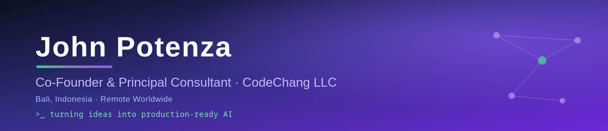

<!-- Profile README for github.com/jpzbkk — lives in the special repo jpzbkk/jpzbkk -->
<!-- Style: "Branded & premium" (approved 2026-07-06). All imagery is external URL — no files to upload. -->

### Turning ideas into production-ready AI

🧠 &nbsp;AI Strategy &nbsp;•&nbsp; ⚙️ &nbsp;Intelligent Automation &nbsp;•&nbsp; 📱 &nbsp;Mobile &amp; SaaS &nbsp;•&nbsp; ☁️ &nbsp;Cloud

---

## 👋 &nbsp;About

I help businesses identify where **AI can deliver measurable value**, design practical implementation strategies, and build production systems that automate workflows, improve customer experiences, and accelerate product development.

I founded **CodeChang LLC** in 2019 to turn ideas into production-ready software — and today the focus is practical, maintainable AI that solves real business problems, **not another chatbot**. I work closely with founders and leadership teams to bridge the gap between business goals and technical execution — from AI strategy through architecture, delivery, and long-term support.

Engagements typically begin with an **AI Discovery Workshop** — mapping business processes, identifying automation opportunities, evaluating ROI, and defining an implementation roadmap.

## 🛠️ &nbsp;Core Services

| | |
|---|---|
| 🔍 **AI Discovery & Assessment** | Opportunity mapping, ROI, roadmap |
| 🧠 **AI Strategy & Implementation** | Custom AI Agents · RAG · LLM & MCP integration |
| ⚙️ **Automation** | Business process & workflow optimization |
| 📱 **Product Engineering** | SaaS · Full-stack web · iOS / Android / cross-platform |
| ☁️ **Architecture & Cloud** | API design, cloud infrastructure, software architecture |
| 🧭 **Fractional CTO** | Technical leadership from concept to production |

## 🧰 &nbsp;Tech Stack

**AI**
&nbsp;

**Languages & Frameworks**
&nbsp;

**Data · APIs · Infra**
&nbsp;

## 🚀 &nbsp;Highlighted Project — AAR-GO

A **medical-coding & billing platform for anesthesiologists**, built 2019–2025 in New York. Delivered as a cross-platform mobile app (Expo / React Native, iOS + Android) for practitioners, paired with a web admin portal for billing operations on a GraphQL API with Vue, React, and MongoDB. An end-to-end product spanning native mobile, real-world healthcare billing workflows, and a full back-office system.

---

### Let's build something practical.

AI Strategy • AI Agents • RAG • MCP • Automation • SaaS • Mobile • Cloud

